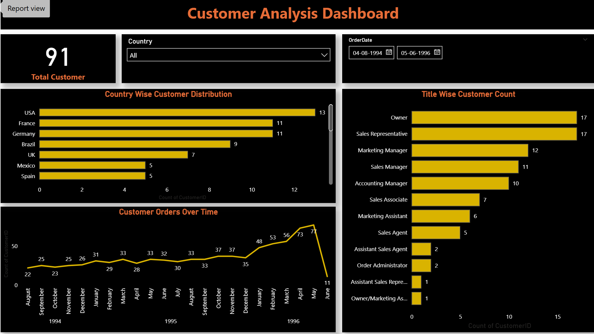

# 📊 Northwind Sales Performance Dashboard  

## 🧩 Problem Statement  
The *Northwind Company* wants to gain data-driven insights into its sales and operations to answer:  

🌎 How are sales performing across regions, categories, and customers?  
💰 Who are the top customers, employees, and suppliers driving revenue?  
🚚 How efficient is the shipping process and what are the associated costs?  
📈 What trends and patterns exist in sales over time?  

## 🛠 Tools & Technologies  

| Tool | Purpose |
|------|----------|
| 🗃 *SQL* | Data cleaning, transformation, and joining multiple tables |
| 📑 *Excel* | Initial data exploration & preprocessing |
| 📊 *Power BI* | Dashboard design, DAX measures, KPIs, and visualizations |

## 🚀 Project Workflow  

### 🧹 1. Data Cleaning & Preparation (SQL)
- Removed duplicates and null values  
- Standardized column names for consistency  
- Merged *8+ related tables*: Orders, Customers, Employees, Products, Suppliers, Shippers, Categories, Regions

### 🧩 2. Data Modeling  
- Built relationships between *fact* and *dimension* tables  
- Applied *Primary & Foreign Keys* for proper joins  
- Ensured a *Star Schema* model for efficient analysis  

### 📊 3. Dashboard Development (Power BI)  

#### *Key KPIs*
💵 *Total Sales:* $1.27M  
🧾 *Total Orders:* 830  
👥 *Customer Count:* 91  
📦 *Total Quantity:* 51K  
📈 *YoY Sales Growth:* 68%  

#### *Dashboard Features*
- Dynamic *slicers* (Year, Category, Country)  
- *Trend analysis* for Sales & Orders over time  
- *Interactive visuals* for detailed insights  

### 🧮 4. DAX & Calculations  
- 📅 *Average Shipping Days*  
- 🚢 *Freight Cost per Order*  
- 👔 *Employee Tenure Distribution*  
- 📊 *YoY % Growth in Sales*

## 🖼 Dashboard Preview  

## 💡 Key Insights  

🏆 *Top Category:* Beverages ($268K) → Dairy Products ($235K)  
🌍 *Top Country:* France ($278K) → Germany ($197K)  
🗺 *Top Region:* Victoria → $863K Sales  
📅 *Peak Sales:* $129K in May 1996 (mainly Beverages)  
⚙ *Improvement Areas:* Employee performance & shipping delays  

## 🧭 Conclusion  
This *Power BI dashboard* provides a 360° business overview, helping management to:  
✅ Identify top-performing products, regions, and employees  
✅ Optimize shipping and supplier costs  
✅ Track sales growth trends and customer behavior  
✅ Make *data-driven strategic decisions*  

## 🔮 Future Enhancements  
📊 Add *Predictive Analytics (Sales Forecasting)*  
🔁 Automate *SQL → Power BI data pipeline*  
👥 Include *Customer Segmentation & RFM Analysis*  

## 👨‍💻 Author  
*Akarsh Dwivedi*  
💼 Aspiring Data Analyst | Turning raw data into meaningful business insights  
🔗 [Connect on LinkedIn](https://www.linkedin.com/in/akarshdwivedi/)  

⭐ If you found this project insightful, don’t forget to star the repository!
